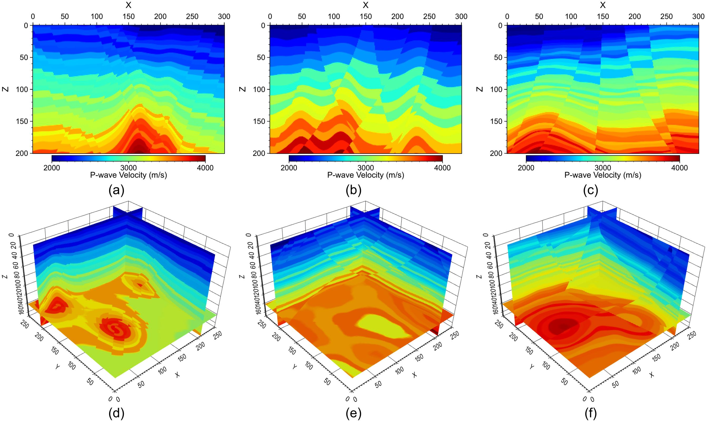
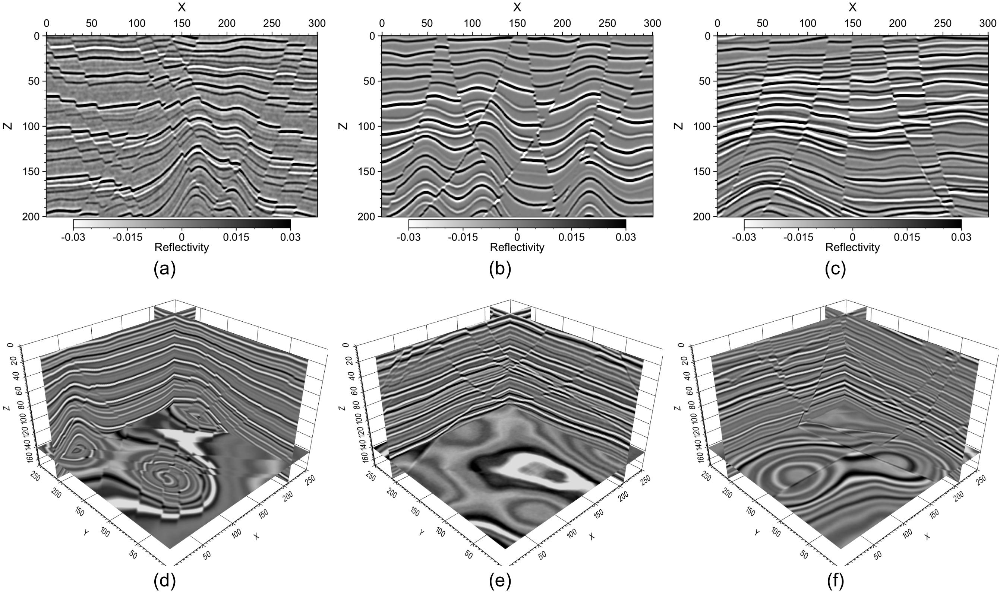
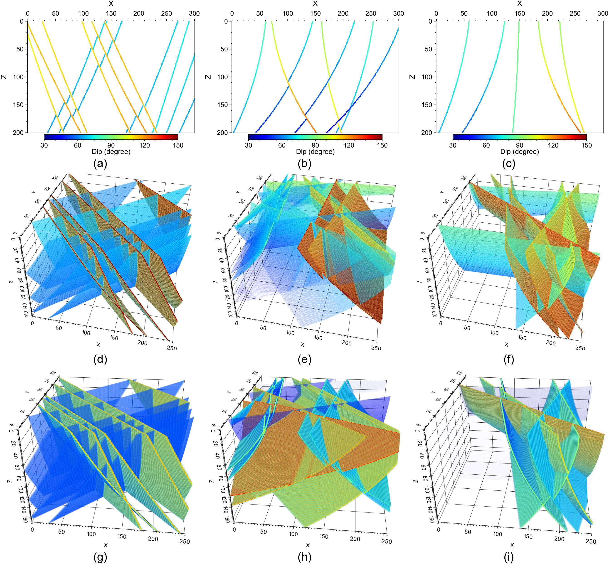
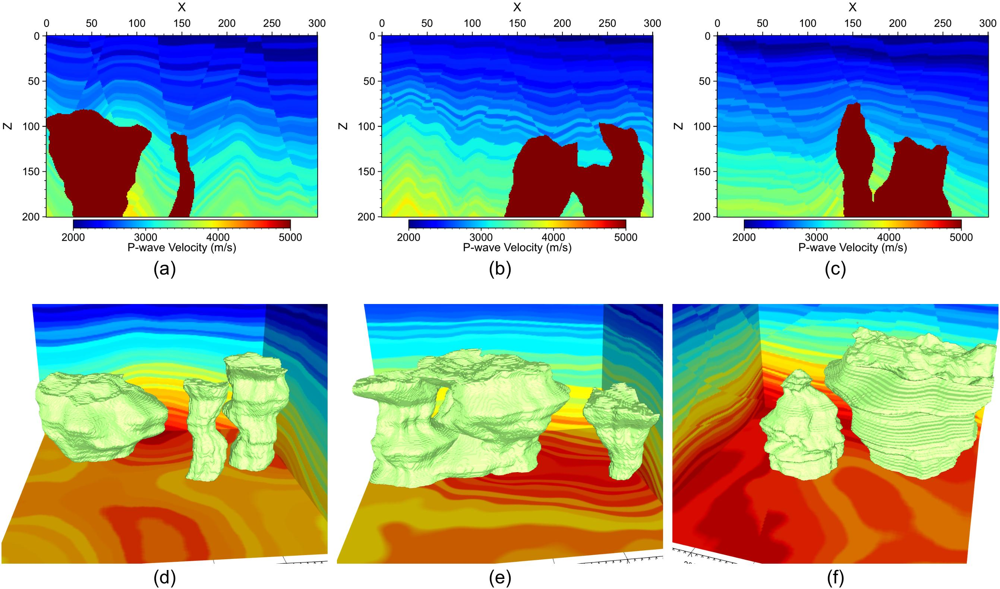
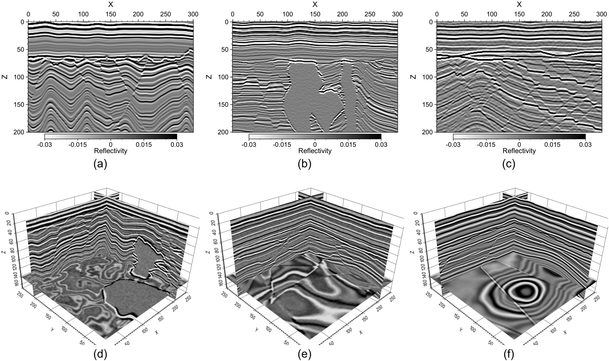
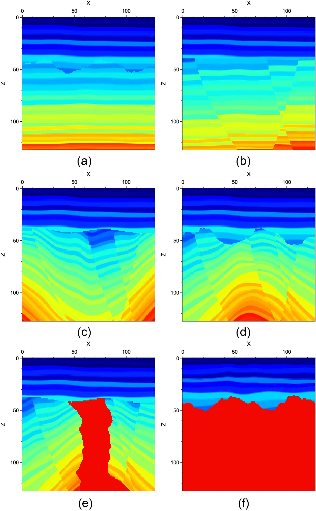
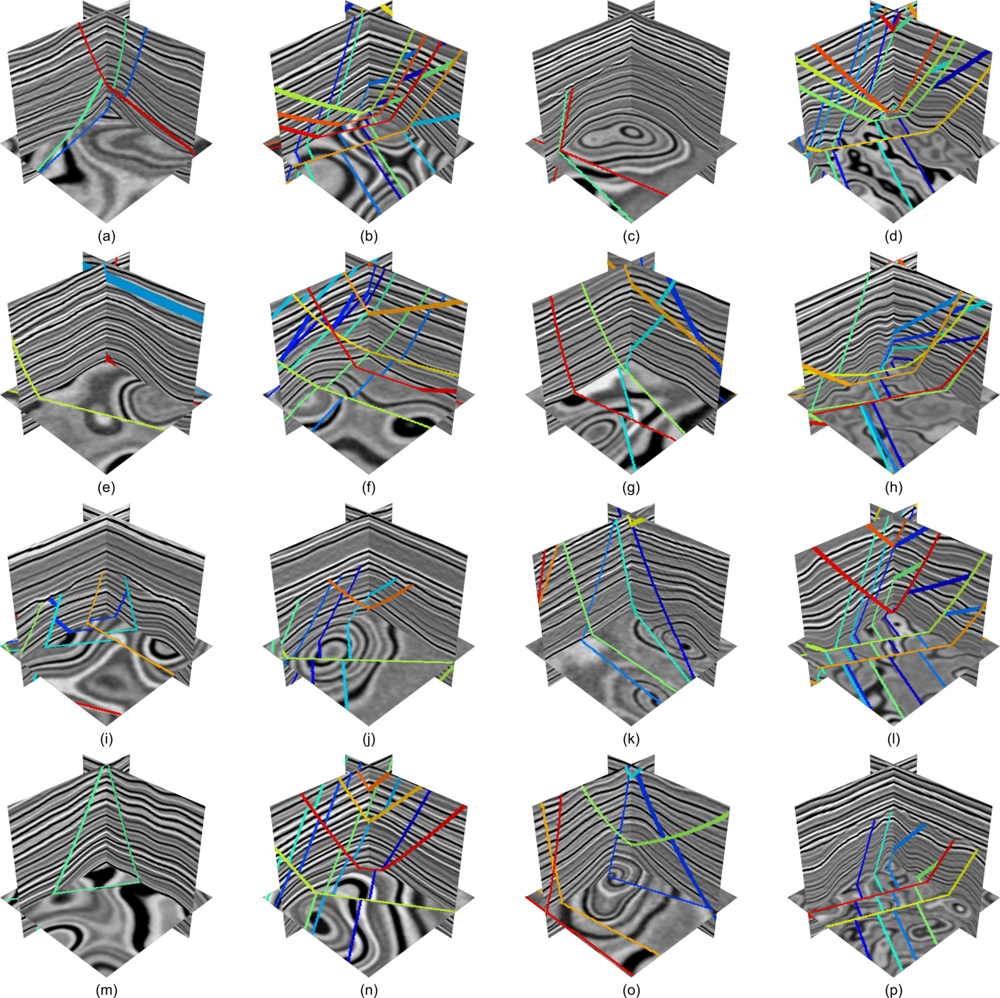

# Description
**RGM: Random Geological Model generation package**

`RGM` is an open-source package for generating realistic random geological models, including medium parameter models $(V_p, V_s, \rho)$, seismic images (PP, PS, SP, and SS images, or just PP images), geological faults, relative geological time volumes, salt bodies, and unconformities, using a multi-randomization method. The generated models can be used to train machine learning models, e.g., the multitask inference-refinement model [MTI-MTR](https://github.com/lanl/mtl) and the seismicity-constrained fault characterization model [SCF](https://github.com/lanl/scf).

The work is supported by Los Alamos National Laboratory (LANL) Laboratory Directed Research and Development (LDRD) project 20240322ER. LANL is operated by Triad National Security, LLC, for the National Nuclear Security Administration (NNSA) of the U.S. Department of Energy (DOE) under Contract No. 89233218CNA000001. The research used high-performance computing resources provided by LANL's Institutional Computing program.

The code is approved for public release under LANL approval reference O4778.

# Requirement
`RGM` depends on [FLIT](https://github.com/lanl/flit).

# Use
The code is written in modern Fortran. To install `RGM`,

```
cd src
make
```

The compiled library file (named `librgm.a`) and module files will be in the [lib](lib) directory.

We include several simple examples of how to use `RGM` in [example](example). To try these examples,

```
cd example
make
```

The compiled executables will be in [example/bin](example/bin). Running these executables will generate images/faults/salt bodies in that directory. All generated files will be in little-endian single-precision raw binary format, with dimensions specified in the respective codes.

The [Makefile](example/Makefile) in the [example](example) directory can serve as an example of how to use `RGM` in your code, including path inclusion and linking of the compiled library/modules.

# License
&copy; 2024-2026. Triad National Security, LLC. All rights reserved.

This program is Open-Source under the BSD-3 License.

Redistribution and use in source and binary forms, with or without modification, are permitted provided that the following conditions are met:

- Redistributions of source code must retain the above copyright notice, this list of conditions and the following disclaimer.

- Redistributions in binary form must reproduce the above copyright notice, this list of conditions and the following disclaimer in the documentation and/or other materials provided with the distribution.

- Neither the name of the copyright holder nor the names of its contributors may be used to endorse or promote products derived from this software without specific prior written permission.

THIS SOFTWARE IS PROVIDED BY THE COPYRIGHT HOLDERS AND CONTRIBUTORS "AS IS" AND ANY EXPRESS OR IMPLIED WARRANTIES, INCLUDING, BUT NOT LIMITED TO, THE IMPLIED WARRANTIES OF MERCHANTABILITY AND FITNESS FOR A PARTICULAR PURPOSE ARE DISCLAIMED. IN NO EVENT SHALL THE COPYRIGHT HOLDER OR CONTRIBUTORS BE LIABLE FOR ANY DIRECT, INDIRECT, INCIDENTAL, SPECIAL, EXEMPLARY, OR CONSEQUENTIAL DAMAGES (INCLUDING, BUT NOT LIMITED TO, PROCUREMENT OF SUBSTITUTE GOODS OR SERVICES; LOSS OF USE, DATA, OR PROFITS; OR BUSINESS INTERRUPTION) HOWEVER CAUSED AND ON ANY THEORY OF LIABILITY, WHETHER IN CONTRACT, STRICT LIABILITY, OR TORT (INCLUDING NEGLIGENCE OR OTHERWISE) ARISING IN ANY WAY OUT OF THE USE OF THIS SOFTWARE, EVEN IF ADVISED OF THE POSSIBILITY OF SUCH DAMAGE.

# Author
Kai Gao, <kaigao@lanl.gov>

We welcome feedback, bug reports, and improvement ideas for `RGM`.

If you use this package in your research and find it useful, please cite it as: 
* Kai Gao, Ting Chen, 2024, RGM: Random Geological Model Generation package, GitHub Repository: [github.com/lanl/rgm](https://github.com/lanl/rgm)
* Kai Gao, Ting Chen, 2026, Generation of random geological models using multi-randomization for machine learning, Computers & Geosciences, doi: [10.1016/j.cageo.2026.106133](https://www.sciencedirect.com/science/article/pii/S0098300426000300)

# Examples

The following figures display some example models generated by RGM (LA-UR-25-27984). 

<p align="center">
  
</p>
<p align="center"><strong>Faulted Vp</strong> </p>

<p align="center">
  
</p>
<p align="center"><strong>Seismic images</strong> </p>

<p align="center">
  
</p>
<p align="center"><strong>Fault attributes</strong> </p>

<p align="center">
  
</p>
<p align="center"><strong>Salt models</strong> </p>

<p align="center">
  
</p>
<p align="center"><strong>Seismic images of unconformity models</strong> </p>

<p align="center">
  
</p>
<p align="center"><strong>Types of unconformities</strong> </p>

<p align="center">
  
</p>
<p align="center"><strong>Labeled seismic images</strong> </p>
