# Description
**RGM: Random Geological Model generation package**

`RGM` is an open-source package for generating realistic random geological models, including medium parameter models $(V_p, V_s, \rho)$, seismic images (PP, PS, SP, SS images, or just PP image), geological faults, relative geological time volume, salt bodies, and unconformities, using a multi-randomization method. The generated models can be used to train machine learning models, e.g., multitask inference-refinement model [MTI-MTR](https://github.com/lanl/mtl) and seismicity-constrained fault characterization model [SCF](https://github.com/lanl/scf).

**What's new in RGM v2.0**:
- The legacy generators (`rgm2`, `rgm3`, `rgm2_elastic`, `rgm3_elastic`) are removed; `rgm2_curved` (2D) and `rgm3_curved` (3D) are the API, and both generate acoustic and elastic models. They generalize the fault geometry: strike-varying faults (`delta_strike`), spatially varying (diminishing) fault displacement with fault tips inside the model (`yn_vary_disp`), and displacement decay away from faults (`yn_disp_decay`, drag/rollover).
- Geomorphological unconformity surfaces: `unconf_shape` can be `meander_channel`, `meander_canyon`, `drainage_channel`, or `drainage_canyon`, generating erosional surfaces from meandering-river and dendritic-drainage simulations, with control over channel width, sinuosity, centerline length, drainage density, and interfluve topography.
- Karst cave systems (`yn_karst`): tube-network caves inserted into the medium parameter models like salt bodies, with a voxel-wise karst mask, a depth window (`karst_z`), and a connection probability (`karst_connect`) that spans scattered isolated caves to a single extensive multi-level network.
- The standalone geomorphological generators (`meandering_channel`, `meandering_canyon`, `drainage_channel`, `drainage_canyon`, `karst_2d`, `karst_3d`) are accessible directly through `librgm`.
- A Python interface: see [python/README.md](python/README.md).

```python
import rgm

p = rgm.rgm3(n1=128, n2=128, n3=128, nf=4, seed=1234,
             delta_strike=[15, 25], yn_vary_disp=True,
             unconf=1, unconf_shape='meander_channel', yn_karst=True)
p.generate()
vp, image, fault = p.vp, p.image, p.fault    # numpy arrays
```

**If you need the legacy generators (`rgm2`, `rgm3`, `rgm2_elastic`, `rgm3_elastic`)**:

- Please download v1.0.0 from the history releases, and compile. 
- The legacy generators will not be included or maintained from RGM v2.0. 


The work is supported by Los Alamos National Laboratory (LANL) Laboratory Directory Research and Development (LDRD) project 20240322ER. LANL is operated by Triad National Security, LLC, for the National Nuclear Security Administration (NNSA) of the U.S. Department of Energy (DOE) under Contract No. 89233218CNA000001. The research used high-performance computing resources provided by LANL's Institutional Computing program.

The codes were approved for public release under LANL approval reference O4778.

# Documentation
- [doc/README.md](doc/README.md) is a short tutorial covering installation and the important parameters of `rgm2_curved`/`rgm3_curved`, including all the v2.0 additions.
- [python/README.md](python/README.md) documents the Python interface.
- [doc/rgm_v2](doc/rgm_v2) contains the figures of the v2.0 paper together with the scripts that reproduce them ([doc/rgm_v2/README.md](doc/rgm_v2/README.md)).
- [paper](paper) contains the manuscript describing the v2.0 methodology.

# Requirement
`RGM` is written in modern Fortran and depends on [`FLIT`](https://github.com/lanl/flit), which in turn requires the Intel oneAPI compilers (`ifx`, or `mpiifx` when `FLIT` is built with `use_mpi = on`) and the Intel MKL. Install `FLIT` first, then set `flitdir = ...` in [src/Makefile](src/Makefile) to point at your `FLIT` installation.

The Python interface additionally requires Python >= 3.8 and `numpy`; the Python example script also uses `h5py` and `matplotlib`.

# Installation

## `RGM` (Fortran)

```
cd src
make
```

The compiled static library `librgm.a` and the module files will be at [lib](lib). The [Makefile](example/Makefile) in the [example](example) directory shows how to use `RGM` in your own code, including the include paths and the link of the compiled library/modules.

## `rgm` (Python)

The Python interface is a thin `ctypes` wrapper around the same Fortran code -- no algorithm is reimplemented in Python -- so it needs the shared library rather than the static one:

```
cd src
make so                     # produces lib/librgm.so
cd ..
pip install -e python/
```

`make so` requires `FLIT` to be compiled with `-fPIC`.
To check the installation,

```
python3 -c "import rgm; p = rgm.rgm2(n1=101, n2=201, nf=3, seed=1); p.generate(); print(p.vp.shape)"
```

which should print `(101, 201)`.

An editable install (`pip install -e`) finds `lib/librgm.so` automatically through the repository layout. If you install the package non-editably, or move the shared library elsewhere, point `RGM_LIB` at it:

```
export RGM_LIB=/path/to/librgm.so
```

See [python/README.md](python/README.md) for the full description of the interface, including how to regenerate the C-interoperable shim after adding new Fortran parameters.

# Use
We include several simple examples to use `RGM` in [example](example). To build the Fortran examples,

```
cd example
make
```

The compiled executables will be at [example/bin](example/bin):

| Executable | Source | Generates |
| --- | --- | --- |
| `x_generate_curved_2d` | [example_rgm2_curved.f90](example/example_rgm2_curved.f90) | 2D models covering faults, folding, unconformities, salt, karst, and elastic parameters |
| `x_generate_curved_3d` | [example_rgm3_curved.f90](example/example_rgm3_curved.f90) | the corresponding 3D models |
| `x_generate_channel` | [example_channel.f90](example/example_channel.f90) | models with the four geomorphological unconformity types, in 2D and 3D |
| `x_generate_karst` | [example_karst.f90](example/example_karst.f90) | models with karst cave systems, including karst combined with unconformities and salt |

Running these executables will generate the medium parameter models, seismic images, and the associated labels (fault attributes, RGT, facies, salt and karst masks) in the working directory. All the generated files will be in little-endian single-precision raw binary format, with dimensions specificed in the respective codes.

For the Python interface, [example/example_python.py](example/example_python.py) generates one model for each feature type of `RGM` v2.0, exports the models to `HDF5` files, and plots them:

```
cd example
python3 example_python.py --list     # list the available examples
python3 example_python.py            # generate, export, and plot all of them
python3 example_python.py karst_3d   # or just one of them
```

# License
&copy; 2024-2026. Triad National Security, LLC. All rights reserved.

This program is Open-Source under the BSD-3 License.

Redistribution and use in source and binary forms, with or without modification, are permitted provided that the following conditions are met:

- Redistributions of source code must retain the above copyright notice, this list of conditions and the following disclaimer.

- Redistributions in binary form must reproduce the above copyright notice, this list of conditions and the following disclaimer in the documentation and/or other materials provided with the distribution.

- Neither the name of the copyright holder nor the names of its contributors may be used to endorse or promote products derived from this software without specific prior written permission.

THIS SOFTWARE IS PROVIDED BY THE COPYRIGHT HOLDERS AND CONTRIBUTORS "AS IS" AND ANY EXPRESS OR IMPLIED WARRANTIES, INCLUDING, BUT NOT LIMITED TO, THE IMPLIED WARRANTIES OF MERCHANTABILITY AND FITNESS FOR A PARTICULAR PURPOSE ARE DISCLAIMED. IN NO EVENT SHALL THE COPYRIGHT HOLDER OR CONTRIBUTORS BE LIABLE FOR ANY DIRECT, INDIRECT, INCIDENTAL, SPECIAL, EXEMPLARY, OR CONSEQUENTIAL DAMAGES (INCLUDING, BUT NOT LIMITED TO, PROCUREMENT OF SUBSTITUTE GOODS OR SERVICES; LOSS OF USE, DATA, OR PROFITS; OR BUSINESS INTERRUPTION) HOWEVER CAUSED AND ON ANY THEORY OF LIABILITY, WHETHER IN CONTRACT, STRICT LIABILITY, OR TORT (INCLUDING NEGLIGENCE OR OTHERWISE) ARISING IN ANY WAY OUT OF THE USE OF THIS SOFTWARE, EVEN IF ADVISED OF THE POSSIBILITY OF SUCH DAMAGE.

# Author
Kai Gao, <kaigao@lanl.gov>

We welcome feedback, bug reports, and improvement ideas on `RGM`.

If you use this package in your research and find it useful, please cite it as

* Kai Gao, 2024, RGM: Random Geological Model Generation package, GitHub Repository: [github.com/lanl/rgm](https://github.com/lanl/rgm)
* Kai Gao, Ting Chen, 2026, Generation of random geological models using multi-randomization for machine learning, Computers & Geosciences, doi: [10.1016/j.cageo.2026.106133](https://www.sciencedirect.com/science/article/pii/S0098300426000300)

The v2.0 features -- the fault generalizations, the meandering-channel, canyon, and drainage unconformities, and the karst systems -- are described in

* Kai Gao, 2026, RGM 2.0: Improved random geological model generation with geometrically realistic faults, meandering channels, canyons, and karst for machine learning in seismic interpretation, _under review with Comoputers & Geosciences_, LA-UR-26-27587.

# Examples

The following figures display some example models generated by RGM (LA-UR-25-27984; LA-UR-26-27587). 

## RGM v2.0

These are selected figures of the v2.0 paper. The full set, together with the scripts that reproduce them, is in [doc/rgm_v2](doc/rgm_v2).

<p align="center">
  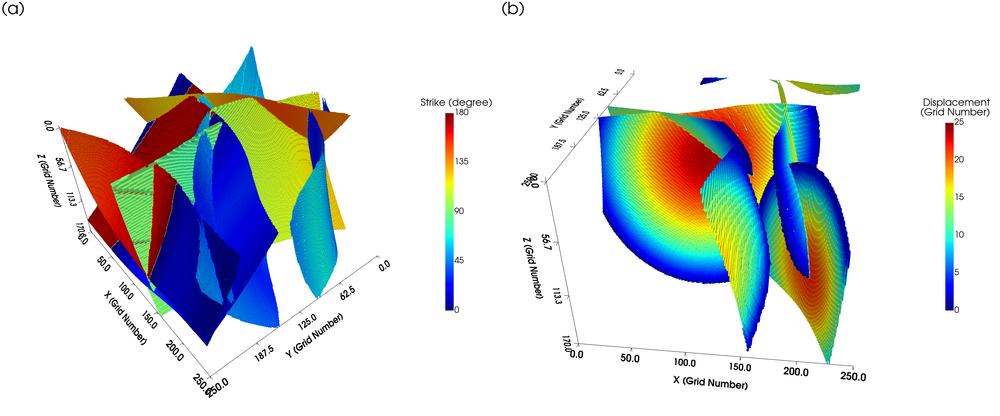
</p>
<p align="center"><strong>Fault surfaces</strong>: (a) through-going strike-varying faults, colored by local strike; (b) faults with spatially varying displacement, colored by local displacement </p>

<p align="center">
  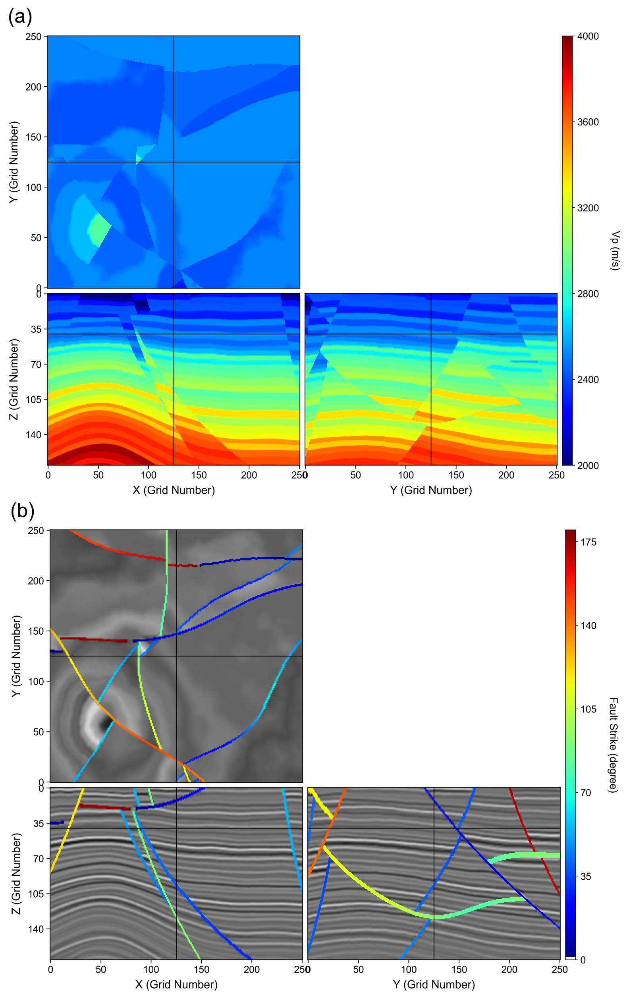
</p>
<p align="center"><strong>Strike-varying faults</strong>: (a) Vp model; (b) local strike angle overlaid on the seismic image </p>

<p align="center">
  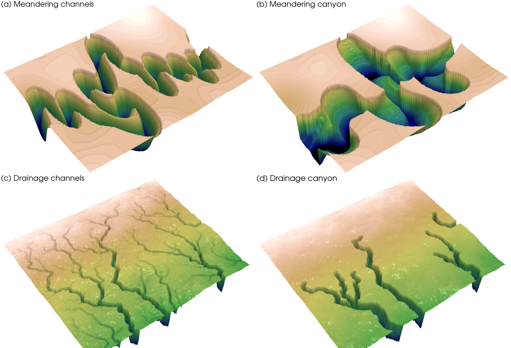
</p>
<p align="center"><strong>Erosional topographies of the four geomorphological unconformity types</strong> </p>

<p align="center">
  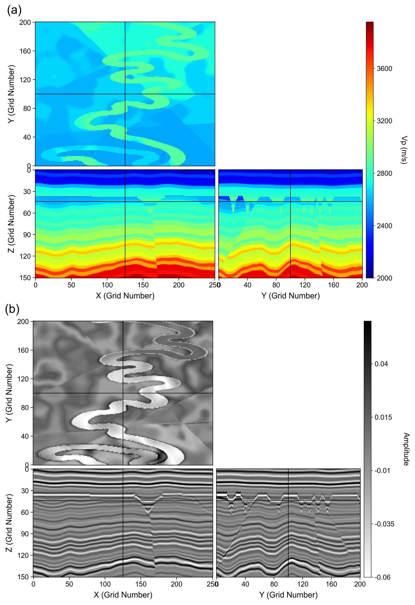
</p>
<p align="center"><strong>Meander-channel unconformity</strong>: (a) Vp model; (b) seismic image, with a depth slice through the erosional surface and two vertical sections </p>

<p align="center">
  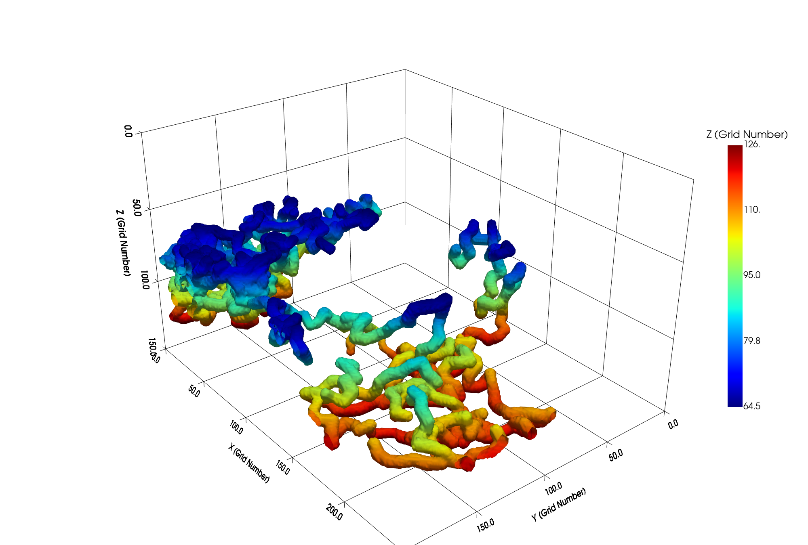
</p>
<p align="center"><strong>Karst cave network</strong>, colored by depth, for a high connection probability </p>

<p align="center">
  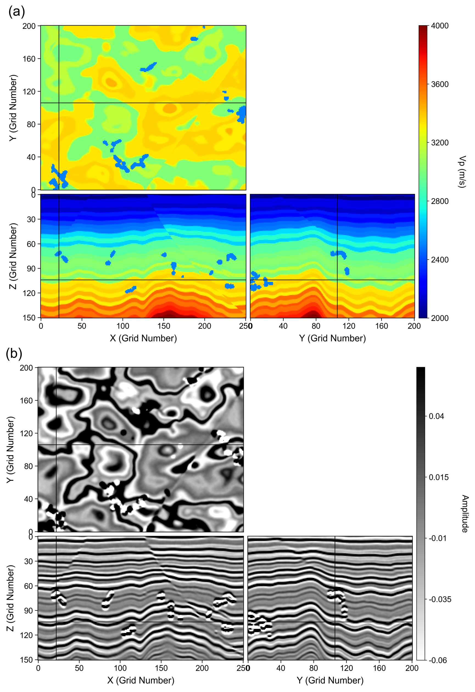
</p>
<p align="center"><strong>Embedded karst cave system</strong>: (a) Vp model; (b) the corresponding seismic image </p>

## RGM v1.0

<p align="center">
  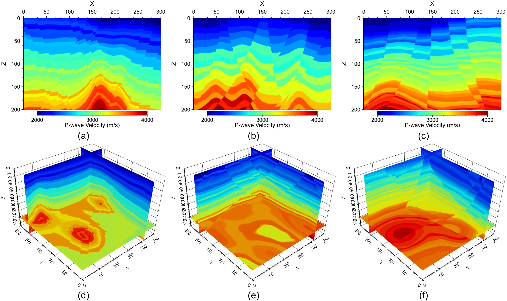
</p>
<p align="center"><strong>Faulted Vp</strong> </p>

<p align="center">
  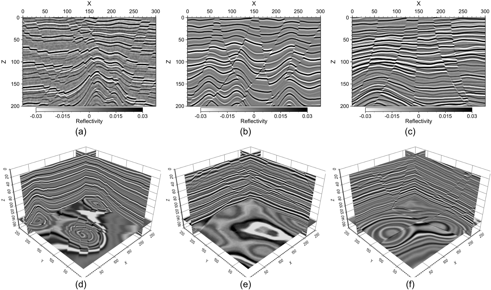
</p>
<p align="center"><strong>Seismic images</strong> </p>

<p align="center">
  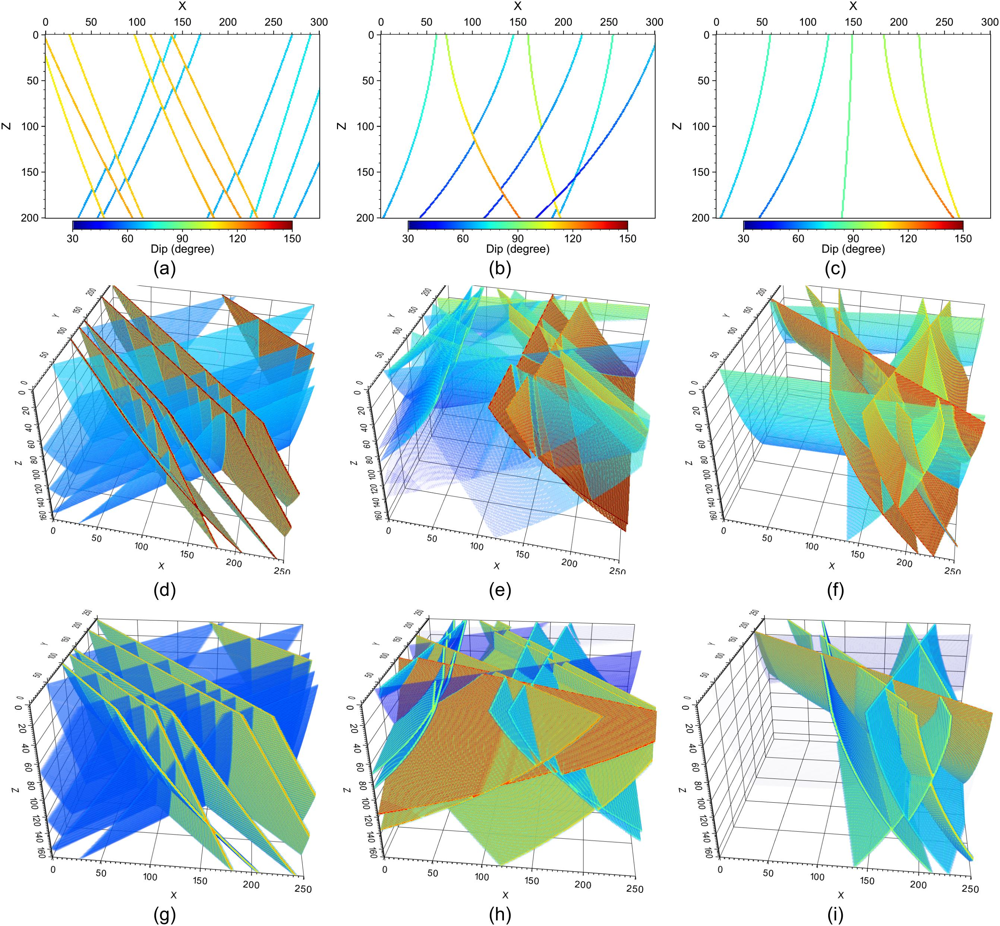
</p>
<p align="center"><strong>Fault attributes</strong> </p>

<p align="center">
  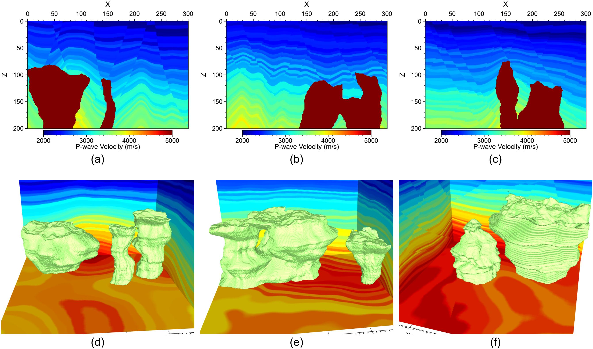
</p>
<p align="center"><strong>Salt models</strong> </p>

<p align="center">
  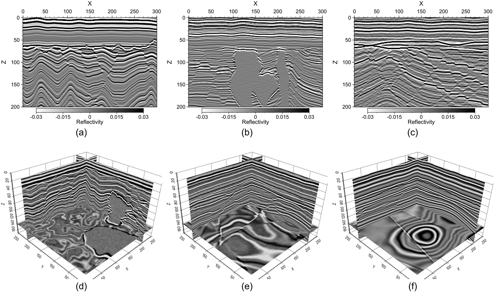
</p>
<p align="center"><strong>Seismic images of unconformity models</strong> </p>

<p align="center">
  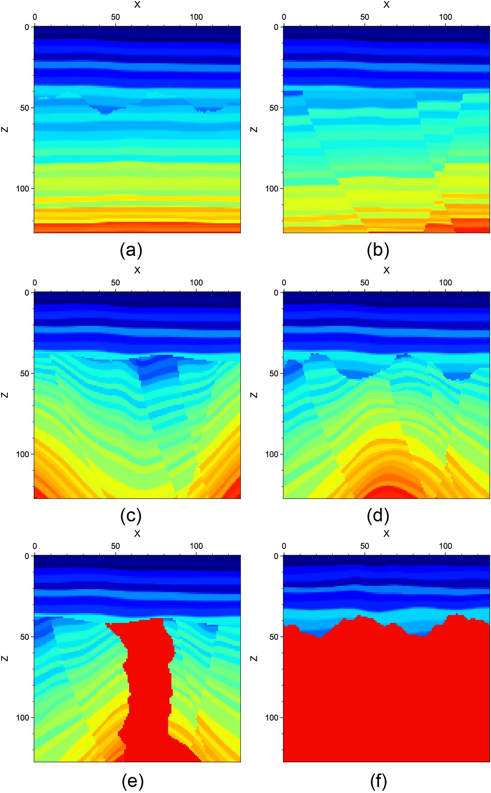
</p>
<p align="center"><strong>Types of unconformities</strong> </p>

<p align="center">
  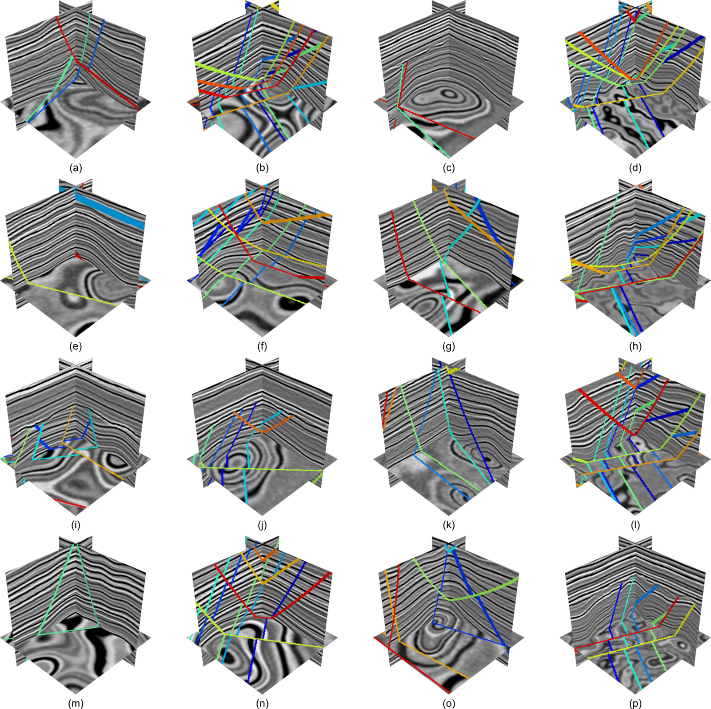
</p>
<p align="center"><strong>Labeled seismic images</strong> </p>
